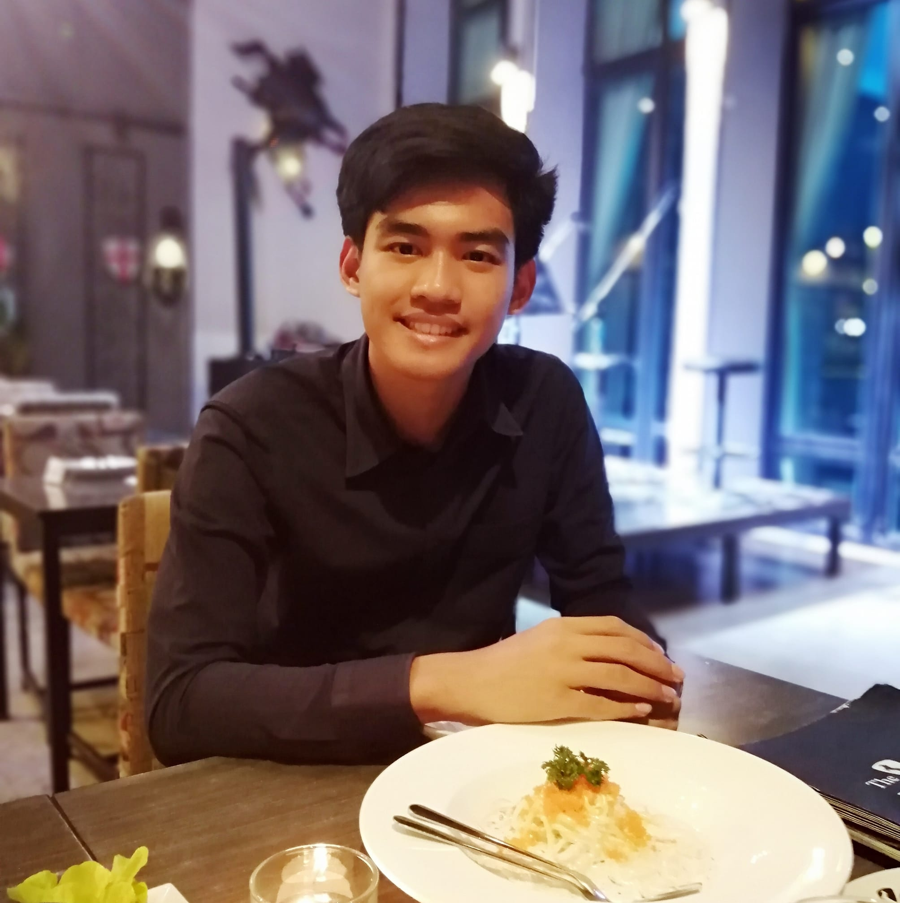
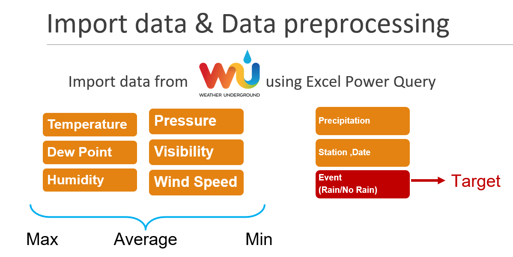

## Welcome to Yannawut Kimnaruk's Page

My name is Yannawut Kimnaruk. I am a petroleum engineer who eager to learn new things.
This page contains some of my works including data science project and article. Feel free to explore.

## Weather Forecast

[Project Jupyter Notebook and Data](Weather Forecast/)
## Thai-Japan Hackathon 
Data from car sensor including location, speed , direction, taxi meter, time.
Analyze top most area that passenger get ON the taxi to identify pick up locations for drive sharing.

Product: Sharide - Drive sharing application
[Application UI](https://xd.adobe.com/view/dabcc3e6-1faf-459d-7e9c-5b41379190fd-ac8d/)
## Articles
1. เมื่อคนนอกวงการ IT มางาน Tencent Openhouse#13: AI & Machine Learning III
[Article Link](https://medium.com/@yannawut/%E0%B9%80%E0%B8%A1%E0%B8%B7%E0%B9%88%E0%B8%AD%E0%B8%84%E0%B8%99%E0%B8%99%E0%B8%AD%E0%B8%81%E0%B8%A7%E0%B8%87%E0%B8%81%E0%B8%B2%E0%B8%A3-it-%E0%B8%A1%E0%B8%B2%E0%B8%87%E0%B8%B2%E0%B8%99-tencent-openhouse-13-ai-machine-learning-iii-fd165bf20589?fbclid=IwAR3NEE8sO33AFm2QgqbsGeOcnbxdyVwdWUROjCexERfhfH-szYALDdYwZgs)
2. มีอะไรในงาน Tencent Openhouse#14
[Article Link](https://medium.com/@yannawut/%E0%B8%A1%E0%B8%B5%E0%B8%AD%E0%B8%B0%E0%B9%84%E0%B8%A3%E0%B9%83%E0%B8%99%E0%B8%87%E0%B8%B2%E0%B8%99-tencent-openhouse-14-97fefc754431)
## Chatbot
[Image of pokemon chatbot](Image/pokemon chatbot.png)
[Sample Clip](https://www.youtube.com/watch?v=0_xFSLVKsmY)
